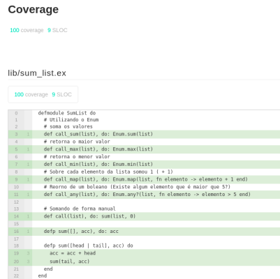

# Chapter 01 - Fundamentos do Elixir (SumList)

1. Somar os elementos de uma lista de forma manual
2. Aprender os primeiros conceitos de utilização do Emum

## Passos Adicionais
1. Declaração de todas as funcionalidades do Enum aprendidas no capítulo de forma individual.
2. Utilização da biblioteca [excoveralls](https://github.com/parroty/excoveralls) para monitoração dos testes da aplicação.

```
mix coveralls.html
```
3. Testes de Unidade para toda a aplicação (Incluindo as funções Enum)


## Conteúdo Desenvolvido nos Cursos


